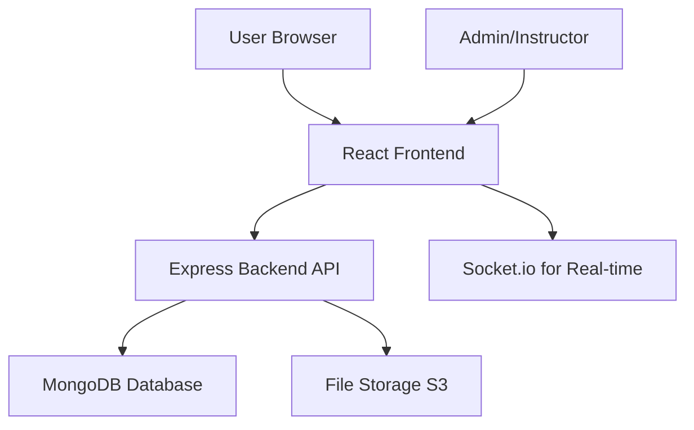

# Gamified Learning Platform - Detailed Plan

## Overview

This plan outlines the development of a scalable, user-friendly, and engaging web-based gamified learning platform. The platform will support multiple subjects with customizable modules, incorporating features like user progress tracking, rewards systems, interactive quizzes, and leaderboards to enhance educational engagement.

## Key Features

- **User Management**: Registration, login, profiles with avatars and customizable settings.
- **Course and Module System**: Instructors can create and manage courses divided into modules for various subjects (e.g., math, science, programming). Modules are customizable and can include text, videos, and quizzes.
- **Interactive Quizzes**: Support for multiple question types (multiple-choice, true/false, fill-in-the-blank, coding challenges). Real-time feedback and hints.
- **Progress Tracking**: Visual progress bars, completion percentages, and detailed analytics for users and instructors.
- **Rewards System**: Points, badges, levels, and achievements to motivate learners. Unlockable content based on progress.
- **Leaderboards**: Global and subject-specific rankings based on points, quiz scores, and completion rates.
- **Social Features**: Comments on modules, progress sharing, and collaborative challenges.
- **Dashboard**: Personalized user dashboard with recommended modules, recent activity, and performance metrics.
- **Admin Panel**: For instructors to manage content, view analytics, and moderate users.

## Technology Stack

- **Frontend**: React.js for building a dynamic single-page application (SPA). Redux for state management. Material-UI or Tailwind CSS for responsive, modern UI components.
- **Backend**: Node.js with Express.js for building RESTful APIs. JWT for secure authentication and authorization.
- **Database**: MongoDB (NoSQL) with Mongoose for flexible schema design, suitable for handling varied educational content.
- **Additional Tools**: Socket.io for real-time quiz interactions if needed. Axios for API calls. Jest for testing.
- **Deployment**: Docker for containerization, AWS (EC2, S3 for media) or Heroku for hosting. CI/CD with GitHub Actions.
- **Why this stack?**: React provides a rich, interactive UI; Node.js ensures fast backend performance; MongoDB scales well for user-generated content. This combination is cost-effective, scalable, and widely adopted for web apps.

## System Architecture

The architecture follows a client-server model with a modular backend.

### High-Level Architecture Diagram



- **Frontend Layer**: Handles UI rendering, user interactions, and API calls.
- **Backend Layer**: Manages business logic, authentication, and data processing.
- **Database Layer**: Stores user data, courses, progress, etc.
- **Scalability Considerations**: Use load balancers, caching (Redis), and horizontal scaling for the backend. Database sharding for large user bases.

### Data Flow

1. User logs in → JWT token issued.
2. User accesses dashboard → API fetches personalized data.
3. User takes quiz → Frontend sends answers → Backend validates and updates progress/rewards.
4. Leaderboard updates → Real-time broadcast via WebSockets.

## Database Schema

Using MongoDB collections:

- **Users**:

  ```javascript
  {
    _id: ObjectId,
    name: String,
    email: String,
    password: String (hashed),
    level: Number,
    points: Number,
    badges: [ObjectId], // References to Badge collection
    enrolledCourses: [ObjectId],
    createdAt: Date
  }
  ```

- **Courses**:

  ```javascript
  {
    _id: ObjectId,
    title: String,
    subject: String,
    description: String,
    modules: [ObjectId],
    instructor: ObjectId,
    difficulty: String
  }
  ```

- **Modules**:

  ```javascript
  {
    _id: ObjectId,
    courseId: ObjectId,
    title: String,
    content: String, // Rich text or markdown
    quizzes: [ObjectId],
    order: Number
  }
  ```

- **Quizzes**:

  ```javascript
  {
    _id: ObjectId,
    moduleId: ObjectId,
    questions: [{
      type: String, // 'multiple-choice', 'true-false', etc.
      question: String,
      options: [String],
      correctAnswer: String,
      points: Number
    }],
    timeLimit: Number // in minutes
  }
  ```

- **Progress**:

  ```javascript
  {
    _id: ObjectId,
    userId: ObjectId,
    moduleId: ObjectId,
    completed: Boolean,
    score: Number,
    attempts: Number,
    lastAccessed: Date
  }
  ```

- **Rewards/Badges**:
  ```javascript
  {
    _id: ObjectId,
    name: String,
    description: String,
    criteria: String, // e.g., 'Complete 5 modules'
    icon: String // URL
  }
  ```

## RESTful API Endpoints

- **Authentication**:

  - `POST /api/auth/register` - User registration
  - `POST /api/auth/login` - User login
  - `POST /api/auth/logout` - Logout

- **Courses**:

  - `GET /api/courses` - List all courses
  - `POST /api/courses` - Create new course (instructor only)
  - `GET /api/courses/:id` - Get course details

- **Modules**:

  - `GET /api/modules/:courseId` - Get modules for a course
  - `POST /api/modules` - Create module

- **Quizzes**:

  - `GET /api/quizzes/:moduleId` - Get quiz for module
  - `POST /api/quizzes/:id/submit` - Submit quiz answers

- **Progress**:

  - `GET /api/progress/:userId` - Get user progress
  - `PUT /api/progress` - Update progress

- **Leaderboards**:
  - `GET /api/leaderboard/global` - Global leaderboard
  - `GET /api/leaderboard/:subject` - Subject-specific leaderboard

## Wireframes and UI/UX Mockups

- **Dashboard**: Grid layout with progress cards, recommended modules, and leaderboard preview.
- **Quiz Interface**: Question display with timer, answer options, and instant feedback.
- **Leaderboard**: Table with user rankings, points, and badges.
- **Profile Page**: User stats, earned badges, and enrolled courses.

Use tools like Figma or Adobe XD for detailed mockups.

## Code Snippets for Core Components

### Frontend: React Quiz Component

```jsx
import React, { useState } from "react";
import axios from "axios";

const Quiz = ({ quizId }) => {
  const [questions, setQuestions] = useState([]);
  const [currentQuestion, setCurrentQuestion] = useState(0);
  const [answers, setAnswers] = useState({});
  const [score, setScore] = useState(0);

  // Fetch quiz data
  useEffect(() => {
    axios
      .get(`/api/quizzes/${quizId}`)
      .then((res) => setQuestions(res.data.questions));
  }, [quizId]);

  const handleAnswer = (answer) => {
    setAnswers({ ...answers, [currentQuestion]: answer });
    if (answer === questions[currentQuestion].correctAnswer) {
      setScore(score + questions[currentQuestion].points);
    }
    setCurrentQuestion(currentQuestion + 1);
  };

  const submitQuiz = () => {
    axios.post(`/api/quizzes/${quizId}/submit`, { answers, score });
  };

  return (
    <div>
      {currentQuestion < questions.length ? (
        <div>
          <h3>{questions[currentQuestion].question}</h3>
          {questions[currentQuestion].options.map((option) => (
            <button key={option} onClick={() => handleAnswer(option)}>
              {option}
            </button>
          ))}
        </div>
      ) : (
        <div>
          <p>Quiz Complete! Score: {score}</p>
          <button onClick={submitQuiz}>Submit</button>
        </div>
      )}
    </div>
  );
};

export default Quiz;
```

### Backend: Express Route for Quiz Submission

```javascript
const express = require("express");
const router = express.Router();
const Quiz = require("../models/Quiz");
const Progress = require("../models/Progress");

router.post("/quizzes/:id/submit", async (req, res) => {
  const { answers, score } = req.body;
  const userId = req.user.id; // From JWT middleware

  // Validate answers and calculate score
  const quiz = await Quiz.findById(req.params.id);
  // ... validation logic ...

  // Update progress
  await Progress.findOneAndUpdate(
    { userId, moduleId: quiz.moduleId },
    { score, completed: true },
    { upsert: true }
  );

  // Award points/badges
  // ... logic to update user points and check for badges ...

  res.json({ message: "Quiz submitted successfully" });
});

module.exports = router;
```

### Database: Mongoose User Model

```javascript
const mongoose = require("mongoose");

const userSchema = new mongoose.Schema({
  name: { type: String, required: true },
  email: { type: String, required: true, unique: true },
  password: { type: String, required: true },
  level: { type: Number, default: 1 },
  points: { type: Number, default: 0 },
  badges: [{ type: mongoose.Schema.Types.ObjectId, ref: "Badge" }],
  enrolledCourses: [{ type: mongoose.Schema.Types.ObjectId, ref: "Course" }],
  createdAt: { type: Date, default: Date.now },
});

module.exports = mongoose.model("User", userSchema);
```

## Next Steps

This plan provides a foundation. Implementation will follow the todo list for phased development, starting with backend setup and authentication.

## Scalability and Security Considerations

- **Scalability**: Implement caching, database indexing, and CDN for media.
- **Security**: Use HTTPS, input validation, rate limiting, and secure password hashing.
- **User-Friendliness**: Responsive design, accessibility features, and intuitive navigation.
- **Engagement**: Gamification elements like streaks, challenges, and notifications to keep users motivated.
